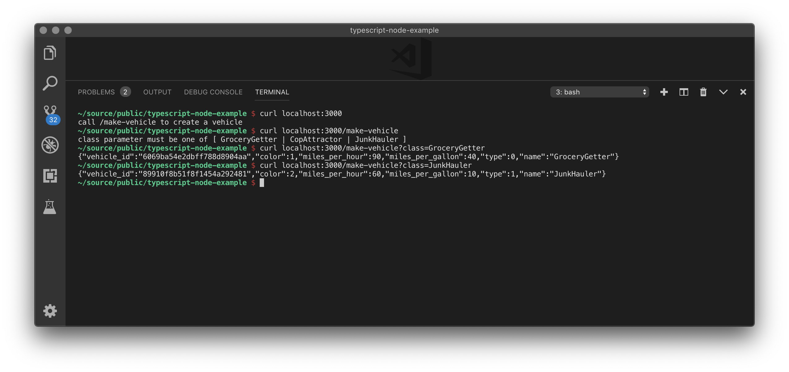
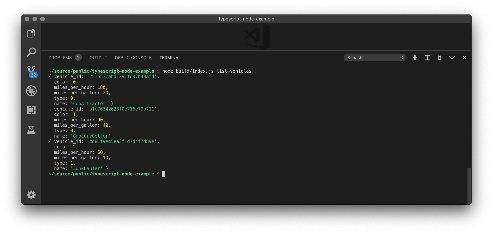

# typescript-node-example
Examples project demonstrating how to build things with TypeScript and Node

## Getting Started
1. Ensure you have somewhat recent versions of [Node](https://nodejs.org/en/) and [TypeScript](https://www.typescriptlang.org)
2. Clone this project
3. In the project folder, run `npm install`

## Testing it out
1. To start the API server, run `node build/index.js start-server`
2. Experiment with the API using `curl localhost:3000`
3. Follow the API help messages to create new vehicles in the data store
4. To list the created vehicles, run `node build/index.js list-vehicles`
